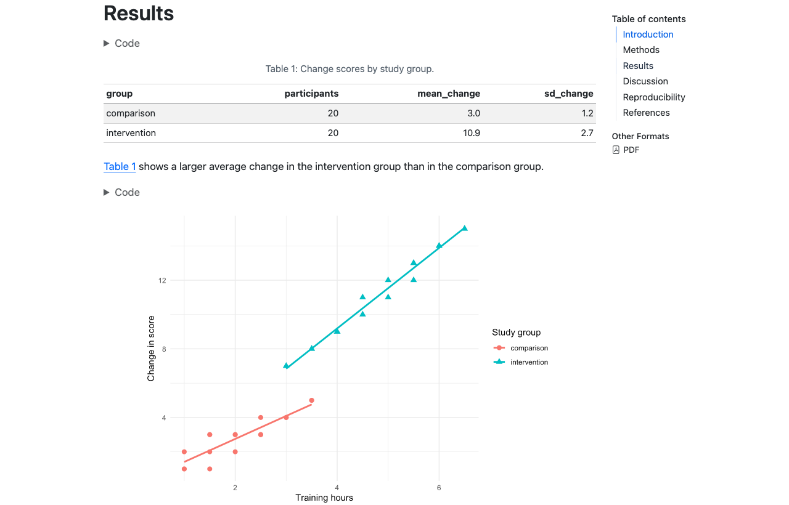
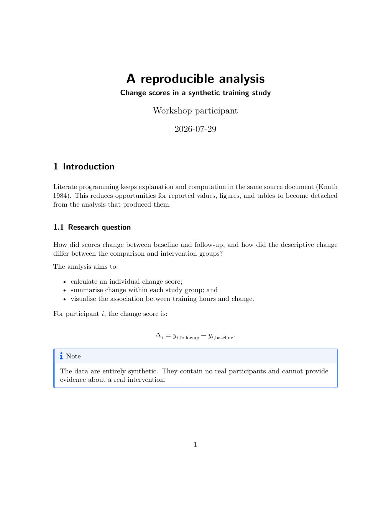
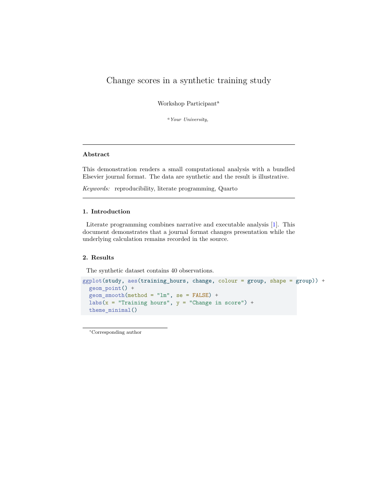
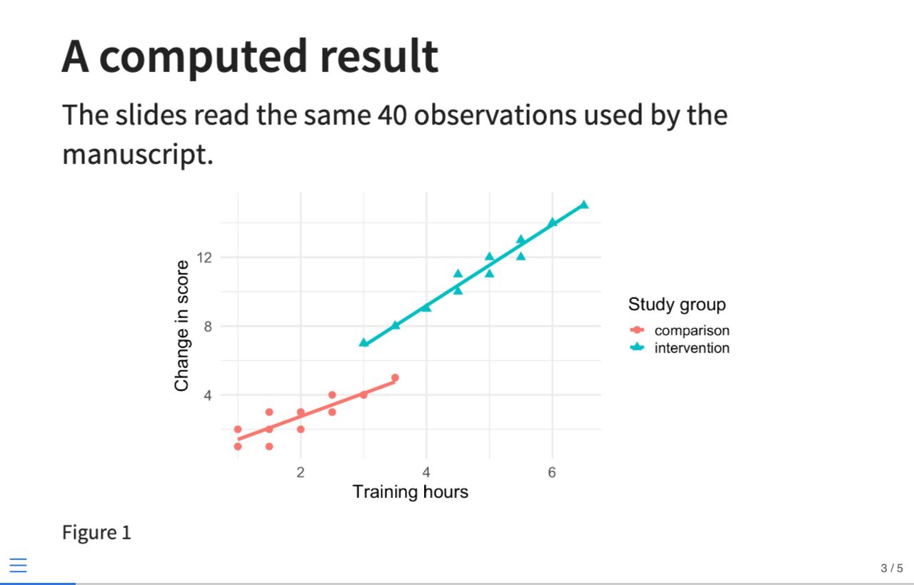

# Research publishing {#sec-research-publishing}

Quarto is not one document style. It is a publishing system that can apply
different output conventions to the same structured source.

## Different kinds of research writing

The underlying Markdown and computation skills transfer across several products:

| Product | Typical reader | Important features |
|---|---|---|
| Analysis note | Yourself or close collaborators | Visible code, diagnostics, rapid iteration |
| Research report | Client, team, or decision maker | Navigation, executive summary, branded output |
| Journal manuscript | Editors, reviewers, scholarly readers | Author metadata, citations, numbered objects, submission template |
| Reproducible manuscript site | Scholarly readers and auditors | Article plus linked computational notebooks and resources |
| Book or technical manual | Learners and long-form readers | Chapters, navigation, cross-chapter references, search |
| Teaching practical | Students and instructors | Exercises, starter code, controlled solutions |
| Presentation | Live audience | Large text, staged explanation, speaker notes |

These are not merely different file extensions. They have different reading
conditions. A slide supports a speaker; a manuscript must stand alone. A tutorial
asks the reader to act; a report may prioritise a conclusion.

The reusable part is the structured content and analysis. The narrative should
still be adapted to its audience.

## What the outputs actually look like

The completed workshop project renders one small analysis to several products.

::: {.output-gallery}
::: {.gallery-item}
### HTML manuscript



HTML provides navigation, links, responsive layout, and optional folded code.
:::

::: {.gallery-item}
### Standard PDF manuscript



PDF fixes typography and page boundaries for distribution and review.
:::
:::

::: {.output-gallery}
::: {.gallery-item}
### Elsevier-format PDF



The journal format changes title metadata, typography, citations, and layout.
:::

::: {.gallery-item}
### RevealJS presentation



The result is reused, but the prose is shortened and the visual is enlarged for
a live audience.
:::
:::

## One source with common and format-specific options

The manuscript declares both HTML and PDF:

```yaml
format:
  html:
    toc: true
    code-fold: true
    number-sections: true
  pdf:
    number-sections: true
    keep-tex: true
```

Options indented under `html` affect only HTML. Options indented under `pdf`
affect only PDF. Shared document metadata sits above `format`:

```yaml
title: "Change scores in a synthetic training study"
author: "A. Researcher"
bibliography: bibliography.bib
number-sections: true
format:
  html:
    toc: true
  pdf: default
```

Move an option to the shared level only when it is valid and intended for every
format.

Render one target:

```bash
quarto render manuscript.qmd --to html
quarto render manuscript.qmd --to pdf
```

Render all declared targets:

```bash
quarto render manuscript.qmd
```

## Format is not content

Ideally these remain identical across outputs:

- data transformations;
- model specifications;
- computed values;
- substantive claims;
- figure and table labels;
- citations; and
- section identifiers.

These may legitimately differ:

- navigation and table of contents;
- page breaks;
- whether code can be folded;
- figure dimensions;
- link presentation;
- supplementary navigation;
- publisher metadata; and
- typography.

If changing from HTML to PDF changes a numerical answer, the project probably
has an execution, state, or conditional-content problem—not a formatting issue.

## HTML, PDF, and Word serve different workflows

| Feature | HTML | PDF | DOCX |
|---|---|---|---|
| Responsive layout | Yes | No | Editor-dependent |
| Fixed pages | No | Yes | Yes, but may reflow |
| Foldable code | Yes | No | No |
| Live hyperlinks | Strong | Supported | Supported |
| Reader annotation | Browser tools | Strong in review tools | Strong in editorial workflows |
| Precise typesetting | Theme/CSS | LaTeX or Typst | Reference document/styles |
| Common use | Web reading | Review and archival copy | Co-author/editor revision |

Word output can be useful even when PDF is the final target. A journal or
co-author may require tracked changes in DOCX. Quarto can use a reference DOCX to
map semantic elements to organisational styles.

Do not promise that every advanced HTML widget or LaTeX command will transfer
perfectly to Word. Prefer portable Markdown, figures, tables, equations, and
cross-references when multi-format output matters.

## Numbering and cross-references survive reformatting

The section labels introduced in @sec-section-crossrefs are format-independent:

```markdown
## Methods {#sec-methods}

See @sec-methods for the study design.
```

Figures and tables use the same model:

```r
#| label: fig-primary-result
#| fig-cap: "Primary outcome by study group."
```

```markdown
The primary comparison is shown in @fig-primary-result.
```

The format decides whether the result is “Figure 1”, “Fig. 1”, or another
publisher convention. The source refers to a stable identifier rather than a
typed number.

## Citation processing

Research publishing involves three separable components:

1. **bibliographic data** in a `.bib` or supported bibliography file;
2. **citation locations** such as `[@knuth1984]` in the source; and
3. **citation style**, supplied by the format or a `.csl` file.

Changing style should not require retyping citations.

```yaml
bibliography: bibliography.bib
csl: journal-style.csl
```

Journal extensions may supply their own CSL, BibTeX style, or citation method.
Check the rendered bibliography for:

- author order and spelling;
- article title and journal;
- year, volume, issue, and pages;
- DOI or URL;
- duplicated records; and
- uncited or missing sources.

Automated formatting faithfully reproduces incorrect metadata.

## Author and affiliation metadata

Quarto supports structured authors:

```yaml
author:
  - name: Alex Researcher
    orcid: 0000-0000-0000-0000
    email: alex@example.edu
    affiliations:
      - ref: university
affiliations:
  - id: university
    name: Example University
    department: School of Research
```

Structured metadata lets a format decide how names, affiliations, email
addresses, and ORCID identifiers appear. A hand-typed title-page paragraph is
harder for templates and indexing systems to interpret.

## What a journal extension contains

A Quarto journal extension can package:

- a LaTeX document class;
- Pandoc template partials;
- CSL or BibTeX styles;
- publisher-specific YAML defaults;
- Lua filters;
- CSS for an HTML preview; and
- a starter article template.

It changes how Quarto translates structured source into a publisher's format.
It should not contain the scientific analysis itself.

## Starting a journal article versus adding a format

For a new article based on a supplied template:

```bash
quarto use template quarto-journals/elsevier
```

This creates a project with example metadata and source.

For an existing article:

```bash
quarto add quarto-journals/elsevier
```

This installs the extension under `_extensions`. The workshop bundles that
folder so the demonstration works without downloading it on the day.

The document can then declare:

```yaml
format:
  elsevier-pdf:
    keep-tex: true
```

The `keep-tex` option is useful when a submission requires generated LaTeX
source or when a template error needs diagnosis.

## Comparing standard and journal output

The standard PDF and Elsevier PDF above contain the same analysis concept but
look different because they serve different conventions.

When comparing formats, check:

- title, author, and affiliation layout;
- abstract and keyword placement;
- heading levels and numbering;
- figure size and placement;
- table width;
- citation and bibliography style;
- line and page breaks;
- supplementary-material requirements; and
- files required for submission.

::: {.callout-warning}
## A template is not the journal instructions

Extensions can lag behind publisher changes, and individual journals can impose
requirements beyond a publisher-wide class. Check the journal's current author
instructions, accepted source formats, required declarations, word limits,
reference style, and figure specifications at the time of submission.
:::

## Conditional content

Occasionally one format needs an explanation or resource that another does not.
Quarto supports format-aware content:

````markdown
::: {.content-visible when-format="html"}
Use the navigation panel to explore the analysis.
:::

::: {.content-visible when-format="pdf"}
The full analysis begins on the next page.
:::
````

Use conditional content sparingly. Duplicated claims can drift apart. Prefer
shared source unless the reading context genuinely differs.

## Page and figure problems are diagnostic

A plot that works in HTML may be too wide for PDF. A long table may overflow a
page. Good repairs include:

- choosing sensible figure dimensions;
- simplifying a figure rather than shrinking all text;
- splitting a table by meaning;
- moving detailed results to an appendix;
- using landscape pages only when necessary; and
- checking the output at its actual reading size.

Avoid format-specific manual spacing and raw LaTeX until semantic options have
been exhausted. Raw fixes often make another output worse.

## Reproducible submission workflow

A defensible workflow is:

1. Render standard HTML frequently during analysis.
2. Render PDF regularly rather than only at submission time.
3. Run a clean render after restarting R.
4. Inspect every numbered reference and citation.
5. Render the journal template from the same source.
6. Compare computed values across outputs.
7. Read the journal's current instructions.
8. Package required source, bibliography, class, figure, and supplementary
   files.
9. Preserve the submitted source and environment record.

## Publishing exercise

Using `manuscript.qmd` and `journal-demo.qmd`:

1. Render the manuscript to HTML and PDF.
2. Compare headings, navigation, code display, figures, tables, and references.
3. Turn section numbering off in HTML only and confirm that cross-references
   still resolve.
4. Turn numbering back on.
5. Render the Elsevier demonstration.
6. Identify at least five presentation changes and confirm that the sample size
   and figure data are unchanged.
7. Find which files in `_extensions/quarto-journals/elsevier` control the class,
   bibliography, and title layout.
8. Write a short submission checklist for a journal relevant to your discipline.

::: {.checkpoint}
### Checkpoint

You can distinguish analysis from format, explain when to start from a template
versus add an extension, and verify that multiple outputs remain substantively
consistent.
:::

